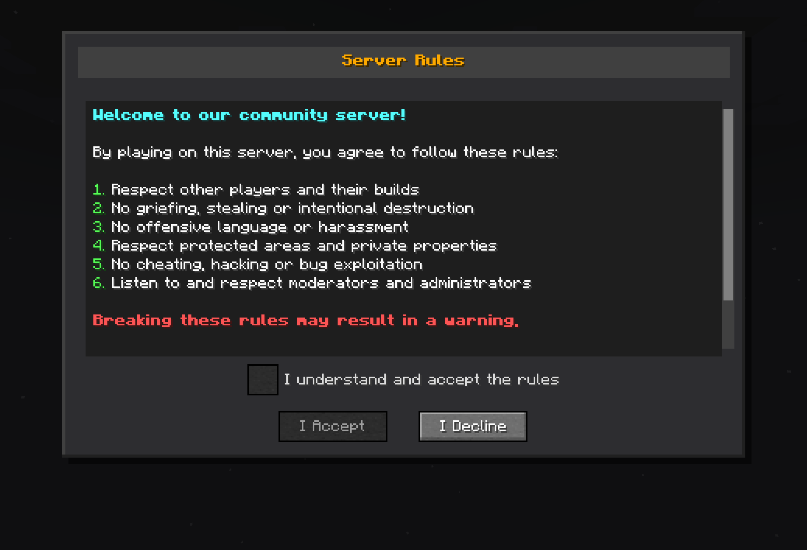
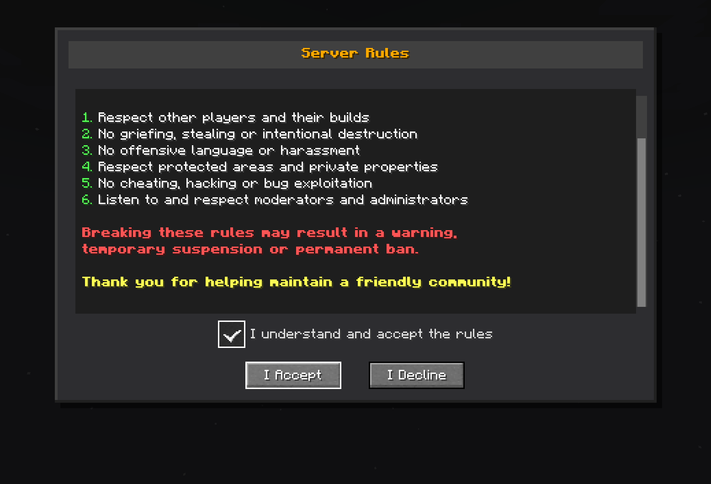

# Server Rules Mod for Minecraft Fabric

**Server Rules** is a Minecraft Fabric mod designed to help streamers and Server Rules easily manage their servers by inviting, uninviting, and banning members of their community. The mod works with the LuckPerms permission management system.

## Features

### Rules System
- **Custom rules screen**: Automatically displays server rules to new players
- **Mandatory validation**: Players must accept the rules to play
- **Graphical interface**: Screen with scrolling, checkbox, and customizable buttons




## Requirements

- **Minecraft**: Version 1.20.1
- **Fabric Loader**: Recent version
- **Fabric API**: Included with the mod

## Installation

1. **Download dependencies**:
   - Install [Fabric Loader](https://fabricmc.net/)

2. **Install the mod**:
   - Place the `serverrules-1.0-SNAPSHOT.jar` file in the `mods/` folder

3. **Start the server**:
   - The mod will configure itself automatically on first startup
   - Configuration file will be created at `config/serverrules/config.yml`

## Configuration

The `config/serverrules/config.yml` file allows you to customize configuration

```yaml
rules:
   enabled: true
   title: §6§lServer Rules
   content: |
      §b§lWelcome to our community server!

      §fBy playing on this server, you agree to follow these rules:

      §a1. §fRespect other players and their builds
      §a2. §fNo griefing, stealing or intentional destruction
      §a3. §fNo offensive language or harassment
      §a4. §fRespect protected areas and private properties
      §a5. §fNo cheating, hacking or bug exploitation
      §a6. §fListen to and respect moderators and administrators

      §c§lBreaking these rules may result in a warning,
      §c§ltemporary suspension or permanent ban.

      §e§lThank you for helping maintain a friendly community!
   accept_button: I Accept
   decline_button: I Decline
   checkbox_text: I understand and accept the rules
   declined_message: You must accept the rules to play on this server.
   accepted_message: You have accepted the server rules. Welcome!
   sending_error_message: 'Error sending rules: %error%'

```

## Usage

When a new player connects to the server:

1. **Automatic display**: The rules screen appears automatically
2. **Mandatory reading**: The player must scroll to the bottom
3. **Validation**: A checkbox becomes available after complete reading
4. **Acceptance**: The player must check the box and click "I Accept"
5. **Memory**: Acceptance is saved, no need to re-validate

## License

This project is licensed under the AGPL-3.0 License - see the [LICENSE](LICENSE.txt) file for details.

## Author

**DrEmixam** - Main developer

## Support

To report bugs or request features, please create an issue on the project repository.

---

